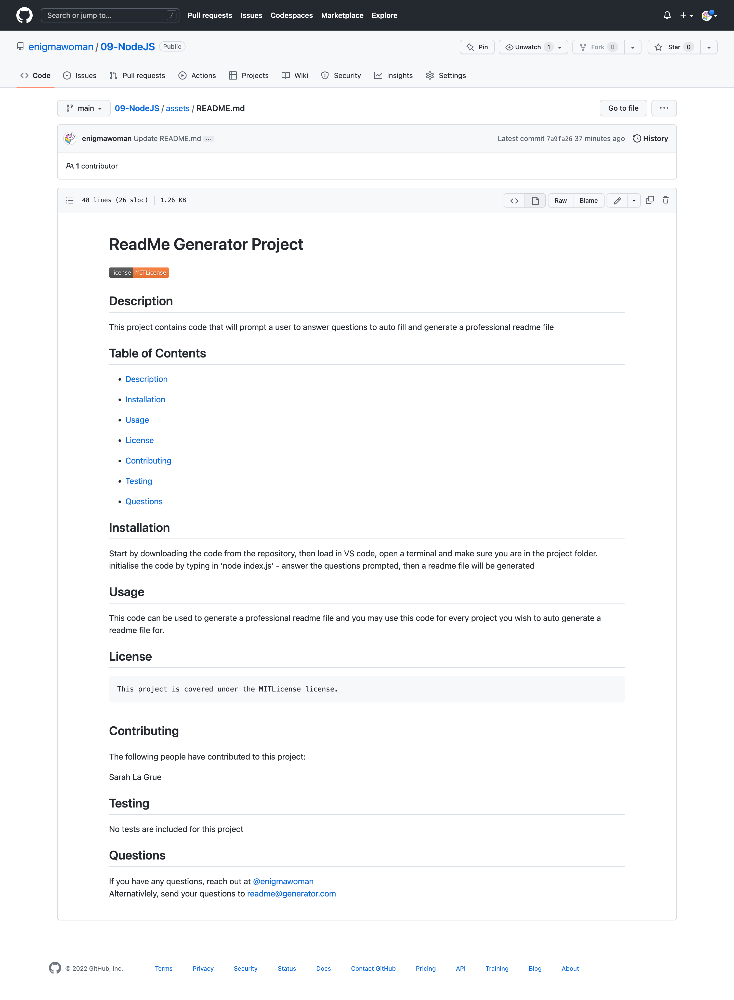

# 09 Node.js | Professional README Generator

Build of a node.js application, that will auto generate a Professional README.md

## Code build

Generating JavaScript code using node.js that when propmted to run by the user in the terminal a series of questions will be asked, of which the answers to, will auto-generate a professional README.md file.

## User Story

AS A developer
I WANT a README generator
SO THAT I can quickly create a professional README for a new project

## Acceptance Criteria

* GIVEN a command-line application that accepts user input
* WHEN I am prompted for information about my application repository
* THEN a high-quality, professional README.md is generated with the title of my project and sections entitled Description, Table of Contents, Installation, Usage, License, Contributing, Tests, and Questions
* WHEN I enter my project title
* THEN this is displayed as the title of the README
* WHEN I enter a description, installation instructions, usage information, contribution guidelines, and test instructions
* THEN this information is added to the sections of the README entitled Description, Installation, Usage, Contributing, and Tests
* WHEN I choose a license for my application from a list of options
* THEN a badge for that license is added near the top of the README and a notice is added to the section of the README entitled License that explains which license the application is covered under
* WHEN I enter my GitHub username
* THEN this is added to the section of the README entitled Questions, with a link to my GitHub profile
* WHEN I enter my email address
* THEN this is added to the section of the README entitled Questions, with instructions on how to reach me with additional questions
* WHEN I click on the links in the Table of Contents
* THEN I am taken to the corresponding section of the README

The main challenge i faced, was getting used to using the node.js application for the first time, however, after a little practise, i found it fairly easy to use and write code that will execute when node runs. 

I also had the opportunity to practise and refine my current JavaScript skills.

I hope to optimize the the code further in the future, when i have more knowledge on node.js & JavaScript.

## Using the code

In order to get the code to run you will first need to download the code from the repository to your local machine. Open the code in your favourite code editor and make sure you are in the right file level in the terminal. To get the code to run, enter 'node index.js' and you will be prompted with a series of questions, the answers to these questions will fill in the sections of the README document that will be created for you. Add the end of the code you should see a 'Success' messaged logged and the generated README file will be added to the assets folder for you.

I have fully commented the JavaScript files, to explain the flow and logic of the code, so that others can work on this and expand on it too.

# The README Generator

## Video demonstration.

<iframe src="https://drive.google.com/file/d/1KbGmUSngkqi71Cl4GAhzy1XBI3pkAw_6/preview" width="640" height="480"></iframe>

<a href="https://drive.google.com/file/d/1KbGmUSngkqi71Cl4GAhzy1XBI3pkAw_6/view">Link to video Demonstration</a>

## Screenshot of the finished website 

## License

NA

